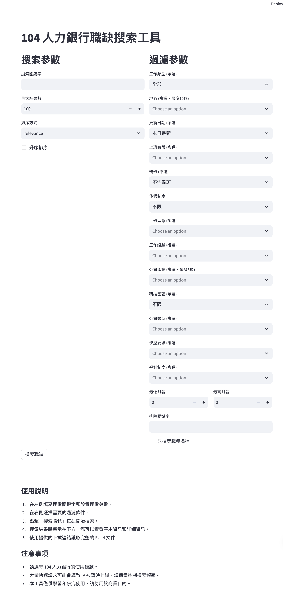

# 104 人力銀行職缺搜索工具

這個專案是一個基於 Streamlit 的應用程式，用於搜索和分析 104 人力銀行的職缺資訊。它提供了一個用戶友好的界面，允許用戶輕鬆地搜索、過濾和下載職缺數據。

## 功能

- **關鍵字搜索**：使用特定關鍵字搜索職缺。
- **高級過濾**：根據多種條件過濾職缺，如工作類型、地區、薪資範圍等。
- **數據可視化**：直觀地顯示搜索結果。
- **數據導出**：將搜索結果導出為 Excel 文件。

## 系統截圖



## 部署步驟

1. **克隆倉庫**
   ```
   git clone https://github.com/your-username/104-job-search-ui.git
   cd 104-job-search-ui
   ```

2. **安裝依賴**
   建議使用虛擬環境：
   ```
   python -m venv venv
   source venv/bin/activate  # On Windows use `venv\Scripts\activate`
   pip install -r requirements.txt
   ```

3. **運行應用**
   ```
   streamlit run job_search_app.py
   ```

4. **訪問應用**
   打開瀏覽器，訪問 `http://localhost:8501`

## 依賴

本項目的依賴包括：

- streamlit==1.24.0
- pandas==1.5.3
- aiohttp==3.8.4
- openpyxl==3.1.2

詳細的依賴列表可以在 `requirements.txt` 文件中找到。

## 注意事項

- 請確保遵守 104 人力銀行的使用條款。
- 避免頻繁、大量的請求，以防 IP 被暫時封鎖。
- 本工具僅供學習和研究使用，請勿用於商業目的。

## 貢獻

歡迎提交 issues 和 pull requests 來改進這個項目。

## 許可證

[MIT License](LICENSE)